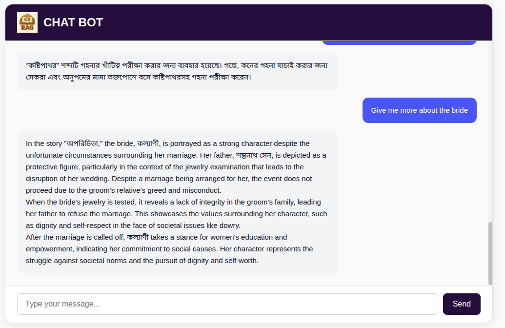

📚 multilingual-rag-bangla

This project implements a Retrieval-Augmented Generation (RAG) pipeline that supports both English and Bangla queries. It retrieves context from the HSC 2026 Bangla 1st Paper textbook and generates meaningful, grounded answers.

The system employs a hybrid retrieval strategy that combines:

    * MultiVectorRetriever and ParentDocumentRetriever for semantic retrieval of dense text chunks,

    * BM25 for sparse, keyword-based search to enhance precision on short or exact-match queries.

Document embeddings are stored and queried using FAISS as the vector store. For PDF preprocessing, the system uses the multilingual-pdf2text module, which integrates Tesseract OCR with Bengali language support (tesseract-ocr-ben) to accurately extract text from scanned or image-based PDFs.

Communication between backend and frontend is handled via FastAPI WebSocket, which manages conversation memory by maintaining a 2–3 message history for context. This memory can be expanded by integrating a database for persistent and scalable context retention.

This architecture ensures robust retrieval and accurate response generation for multilingual educational content.

🛠️ Setup Instructions
1. Activate the Poetry Environment

poetry shell

2. Install Dependencies

poetry install

3. Set Your API Key

Create a .env file in the project root and add your OpenAI API key:

OPENAI_API_KEY=your_openai_api_key_here

4. Install Bangla Support for Tesseract OCR

sudo apt install tesseract-ocr-ben

5. Create the Vector Database

python create_vectorDB.py

6. Start the Backend

python main.py

7. Run the Frontend

Simply open index.html in your web browser.
No server setup is required for the frontend.

🎥 Demo
Click on the image to download the demo video.

🧰 Tools, Libraries, and Packages
* LangChain — Orchestrates retrieval and generation
* FAISS — High-performance vector similarity search
* Tesseract (ben) — Bangla OCR via multilingual_pdf2text
* multilingual_pdf2text — Extracts structured Bangla + English text from PDFs
* FastAPI — Backend API and WebSocket server
* OpenAI GPT models — Embeddings and text generation
* WebSocket — Real-time chat functionality

Assessment Answers
Q1: অনুপমের বাবা কী করে জীবিকা নির্বাহ করতেন?
 A1: অনুপমের বাবা ওকালতি করে জীবিকা নির্বাহ করতেন।

Q2: অনুপমের মামা সম্পর্কে কী কী তথ্য পাওয়া যায়?
 A2: অনুপমের মামা সম্পর্কে নিম্নলিখিত তথ্য পাওয়া যায়:
মামাকে অনুপমের 'ভাগ্যদেবতার প্রধান এজেন্ট' হিসেবে উল্লেখ করা হয়েছে, যার মাধ্যমে পরিবারে প্রভাব বজায় থাকে।
মামা লোভী এবং যৌতুক প্রথার প্রতি আসক্ত ছিলেন। তিনি বিয়েতে টাকা ও গহনা দাবি করেছিলেন।
মামার চরিত্রে গুণাগুণের সাথে যুক্ত রয়েছে অমানবিকতা, যেহেতু তিনি আনন্দের সাথে কন্যার গহনাগুলো যাচাই করতে সেকরা নিয়ে বিয়ের আসরে আসেন।
মামা প্রসঙ্গে উল্লেখিত হয়েছে যে তিনি অন্যায় জানার পরও অনুপমের সিদ্ধান্ত গ্রহণে প্রভাব ফেলেন এবং অনুপমের পিতার আচরণ দেখে অতিশয় সন্তুষ্ট ছিলেন না।
এইসব তথ্য থেকে বোঝা যায় যে, মামার চরিত্রের একটি জটিল পটভূমি রয়েছে যা অনুপমের জীবনে বিভিন্ন প্রভাব ফেলেছে।

Q3: What kind of son-in-law does Anupam’s uncle prefer?
 A3: Anupam’s uncle prefers a son-in-law who is not wealthy and belongs to a humble background. He desires a bride who will come into the family with a sense of subservience, indicated by wanting a girl who will "come bowing her head." He is motivated by a character trait of greed, as he is inclined towards seeking a suitable match that would bring substantial dowry while at the same time, he does not want a daughter-in-law from a wealthy family.

Q4: অনুপমের ভাষায় সুপুরুষ কাকে বলা হয়েছে?
 A4: অনুপমের ভাষায় সুপুরুষ বলা হয়েছে শস্তুনাথকে।

Q5: কাকে অনুপমের ভাগ্য দেবতা বলে উল্লেখ করা হয়েছে?
 A5: অনুপমের ভাগ্য দেবতা হিসেবে উল্লেখ করা হয়েছে মামাকে (উত্তর: খ)।

Q6: How did Binudada describe the bride’s appearance and character?
 A6: Binudada described the bride's appearance as "not bad" and referred to her as "khati sona bête" (meaning "pure gold"), indicating his approval of her value and quality. His language was careful and specific, highlighting his discerning yet supportive nature towards the situation.

Q7: হরিশ কনের বাবার সম্পর্কে কী কী বলেছেন?
 A7: হরিশের বর্ণনায় কনের বাবার পরিচয় সম্পর্কে উল্লেখ রয়েছে যে:
এককালে তাদের বংশে লক্ষ্মীর মঙ্গলঘট উপুঁড় করা ছিল।
দেশে বংশমর্যাদা রক্ষা করা কঠিন বলে তিনি পশ্চিমে গিয়ে বাস করছেন।
কানপুরে তিনি একজন প্রতিষ্ঠিত ডাক্তার।
এগুলি হরিশের বক্তব্য থেকে জানা যায়, যা কনের বাবার সামাজিক অবস্থান এবং পেশার পরিচয় নির্দেশ করে।

Q8: Who was Anupam’s guardian and how did he influence Anupam’s life decisions?
 A8: Anupam's guardian was his uncle (referred to as 'mama'). He greatly influenced Anupam's life decisions, particularly regarding marriage. Anupam's uncle held a significant opinion on whom Anupam should marry, favoring a bride who would come into their home in a submissive manner and was not too wealthy, reflecting a prioritization of financial status over personal choice. This dynamic of reliance on his uncle limited Anupam's ability to make independent decisions, ultimately contributing to the failure of his engagement to Kalpana.

Q9: What role did Harish play in the story?
 A9: In the story "অপরিচিতা," Harish plays a significant role as a key intermediary in the marriage discussions surrounding Anupam and Kalpana. He is characterized as a jovial and persuasive individual who has a way with words, which makes him well-liked in social settings. Harish encourages Anupam to approach his uncle about marrying Kalpana and facilitates the initial discussions that lead to their engagement. However, despite his efforts, the influence and decisions of Anupam's uncle ultimately have a more significant impact on the outcome of the engagement. Harish's optimistic and playful nature contrasts with Anupam's passive character, highlighting the tensions between personal desires and societal expectations.

Q10: Who said “খাঁটি সোনা বটে” and about whom?
 A10: The phrase “খাঁটি সোনা বটে” was said by বিনুদাদা (Binudada) in reference to কল্যাণী (Kalyani).

Q11: “কষ্টিপাথর” শব্দটি কোন প্রসঙ্গে ব্যবহার হয়েছে?
 A11: “কষ্টিপাথর” শব্দটি গহনার খাঁটিত্ব পরীক্ষা করার জন্য ব্যবহার হয়েছে। গল্পে, কনের গহনা যাচাই করার জন্য সেকরা এবং অনুপমের মামা তক্তপোশে বসে কষ্টিপাথরসহ গহনা পরীক্ষা করেন।

Q12: Give me more about the bride
 A12: In the story "অপরিচিতা," the bride, কল্যাণী, is portrayed as a strong character despite the unfortunate circumstances surrounding her marriage. Her father, শন্তুনাথ সেন, is depicted as a protective figure, particularly in the context of the jewelry examination that leads to the disruption of her wedding. Despite a marriage being arranged for her, the event does not proceed due to the groom's relative's greed and misconduct.
When the bride's jewelry is tested, it reveals a lack of integrity in the groom's family, leading her father to refuse the marriage. This showcases the values surrounding her character, such as dignity and self-respect in the face of societal issues like dowry.
After the marriage is called off, কল্যাণী takes a stance for women's education and empowerment, indicating her commitment to social causes. Her character represents the struggle against societal norms and the pursuit of dignity and self-worth.

[]

5. 📡 API Documentation
Health Check
GET /health
Checks whether the retriever is initialized.

Response:

{"status": "ok", "message": "Server and retrievers initialized"}

WebSocket Chat
Endpoint: /ws/chat
 Establishes a WebSocket connection for real-time RAG responses.

Message Format

{"content": "What is the summary of the poem?"}

Response

{"role": "assistant", "content": "The poem emphasizes..."}

Backend maintains short-term memory (last 2 query-response pairs) using conversation_memory.

<!-- 6. 
# What method or library did you use to extract the text, and why? Did you face any formatting challenges with the PDF content?
I used multilingual_pdf2text, which leverages pytesseract (with tesseract-ocr-ben) to handle Bangla text. It was chosen for its OCR accuracy with complex fonts and mixed layouts. Some line breaks and paragraph boundaries were inconsistent, which required post-processing. I have also tried to use unstructured but it lacks inaccurate Bengali text.

# What chunking strategy did you choose? Why do you think it works well for semantic retrieval?
I used a paragraph-based chunking strategy with character limits (max 1000, min 200) and 100-character overlap. This ensures each chunk maintains semantic coherence and enough context for retrieval. Paragraph alignment preserves natural structure, while overlap helps retain continuity between chunks—making it effective for meaningful, context-rich semantic search.

# What embedding model did you use? Why did you choose it? How does it capture the meaning of the text?
I used OpenAI's text-embedding-3-large for multilingual embeddings. It supports Bangla well and captures semantic relationships rather than just keyword similarity, crucial for generating meaningful responses across both languages.

# How are you comparing the query with your stored chunks? Why did you choose this similarity method and storage setup?
I use a hybrid retrieval strategy combining MultiVectorRetriever, ParentDocumentRetriever, and BM25.

* MultiVectorRetriever indexes multiple semantic chunks per document using FAISS and OpenAI embeddings, enabling fine-grained matching at the sub-document level.

* ParentDocumentRetriever retrieves parent documents by embedding their child chunks, then maps the best matches back to larger context blocks—ensuring semantic precision with richer context.

* BM25 retrievers complement this by matching exact keywords and phrases, which is helpful for factual queries.

📌 Why this setup:
 This multi-retriever approach balances semantic depth, context preservation, and keyword accuracy, making the system robust across both vague and specific queries.

# How do you ensure that the question and the document chunks are compared meaningfully? What would happen if the query is vague or missing context?
I ensure meaningful comparison by using query optimization, semantic chunking, and hybrid retrieval.
Queries are optimized for both vector and keyword search.
Chunks are semantically meaningful (paragraph-based with overlap) and stored using MultiVectorRetriever and ParentDocumentRetriever to retain context.
If a query is vague or lacks context, BM25 helps with keyword hits, while vector similarity captures intent.
This combined setup increases the chance of retrieving relevant content even when the query is ambiguous.

# Do the results seem relevant? If not, what might improve them?
Yes, the results are generally relevant. But for better accuracy i can try graph rag which will keep key nodes and relationships with vector searching for semantics similarity. -->

