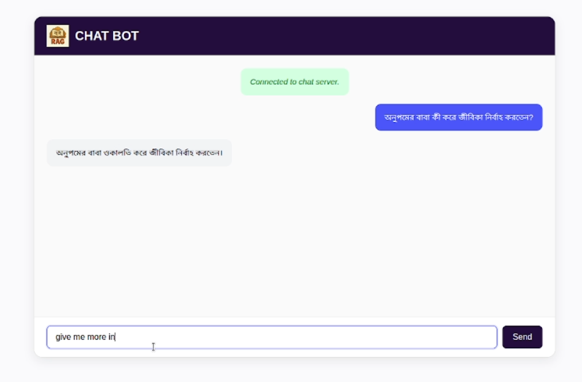

📚 multilingual-rag-bangla

This project implements a Retrieval-Augmented Generation (RAG) pipeline that supports both English and Bangla queries. It retrieves context from the HSC 2026 Bangla 1st Paper textbook and generates meaningful, grounded answers.

The system employs a hybrid retrieval strategy that combines:

    * MultiVectorRetriever and ParentDocumentRetriever for semantic retrieval of dense text chunks,

    * BM25 for sparse, keyword-based search to enhance precision on short or exact-match queries.

Document embeddings are stored and queried using FAISS as the vector store. For PDF preprocessing, the system uses the multilingual-pdf2text module, which integrates Tesseract OCR with Bengali language support (tesseract-ocr-ben) to accurately extract text from scanned or image-based PDFs.

Communication between backend and frontend is handled via FastAPI WebSocket, which manages conversation memory by maintaining a 2–3 message history for context. This memory can be expanded by integrating a database for persistent and scalable context retention.

This architecture ensures robust retrieval and accurate response generation for multilingual educational content.

🛠️ Setup Instructions
1. Activate the Poetry Environment

poetry shell

2. Install Dependencies

poetry install

3. Set Your API Key

Create a .env file in the project root and add your OpenAI API key:

OPENAI_API_KEY=your_openai_api_key_here

4. Install Bangla Support for Tesseract OCR

sudo apt install tesseract-ocr-ben

5. Create the Vector Database

python create_vectorDB.py

6. Start the Backend

python main.py

7. Run the Frontend

Simply open index.html in your web browser.
No server setup is required for the frontend.

🎥 Demo
Click on the image to download the demo video.
